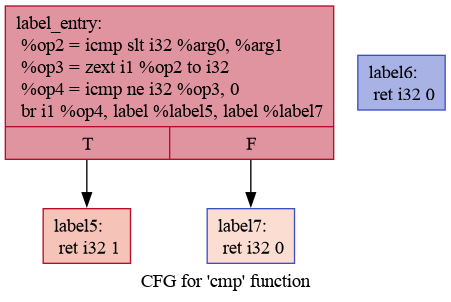

# Mem2Reg

Mem2Reg（Memory to Register Promotion）是一个重要的优化过程，它的主要目标是将内存访问转换为寄存器操作，从而提高程序的执行效率。这个优化过程主要处理程序中的局部变量，特别是那些分配在栈上的变量，将它们转换为 SSA（Static Single Assignment）形式的寄存器值。

在未经优化的代码中，编译器往往会将局部变量放置在栈内存中，这导致每次访问变量时都需要执行内存加载和存储操作。这种方式虽然实现简单且容易理解，但从性能角度来看并不理想，因为内存访问的开销远大于寄存器访问。Mem2Reg 优化正是通过识别这些可以安全转换的内存操作，将它们替换为更高效的寄存器操作。

Mem2Reg 的工作过程通常包含多个步骤。首先，它需要识别哪些内存位置是可被转换的。这些内存位置通常是通过 alloca 指令分配的局部变量。然后，它会分析这些变量的使用模式，包括所有的加载和存储操作。在此基础上，优化器会构建必要的 phi 节点，确保在控制流汇合点正确处理变量的多个可能值。最后，它将内存操作替换为对应的寄存器操作，并建立适当的 SSA 形式。

这个优化过程不仅能直接提升程序性能，还能为后续的优化创造更多机会。例如，当变量被提升到寄存器后，其他优化如常量传播、死代码消除等就能更容易地识别和处理这些值。此外，由于 SSA 形式提供了更清晰的数据流信息，这也有助于编译器进行更准确的分析和更激进的优化。

## 阅读与学习

- 回顾课上关于支配树的介绍，并阅读 [Mem2Reg 介绍](./Mem2Reg介绍.pdf)，了解 Mem2Reg 的基本原理

  > 支配树的相关算法伪代码可以参考如下文章：[Dom.pdf](Dom.pdf)。注意助教在其中的的标注。
  >
- 阅读 PassManager、FuncInfo 和 DeadCode 的实现，了解如何编写 pass

### IR CFG

在实现支配树时，为了方便同学们测试支配树的正确性，本节将向你介绍两个工具：[opt](https://llvm.org/docs/CommandGuide/opt.html) 和 [dot](https://manpages.ubuntu.com/manpages/trusty/man1/dot.1.html)。opt 和 dot 配合使用可以将 IR 文件转换为 CFG 图片，将基本块之间的关系可视化，利用可视化的 CFG，可以判断生成的支配树是否正确。

在你的机器上，opt 已经随 llvm 一起安装，使用以下命令安装 dot：

```
$ sudo apt install graphviz
```

以如下 `test.ll` 文件为例：

??? info "test.ll"

    ```c
    define i32 @cmp(i32 %arg0, i32 %arg1) {
    label_entry:
      %op2 = icmp slt i32 %arg0, %arg1
      %op3 = zext i1 %op2 to i32
      %op4 = icmp ne i32 %op3, 0
      br i1 %op4, label %label5, label %label7
    label5:                                                ; preds = %label_entry
      ret i32 1
    label6:
      ret i32 0
    label7:                                                ; preds = %label_entry
      ret i32 0
    }

    define i32 @main() {
    label_entry:
      %op0 = call i32 @cmp(i32 1, i32 2)
      ret i32 %op0
    }
    ```

在 `test.ll` 的同级目录下：

```shell
$ opt -passes=dot-cfg test.ll >/dev/null
Writing '.cmp.dot'...
Writing '.main.dot'...
```

可以看到 opt 输出了两个 dot 文件，分别与 ll 中的两个函数对应。然后我们使用 dot 工具将其转化为图片：

```shell
$ dot .main.dot -Tpng > main.png
$ dot .cmp.dot -Tpng > cmp.png
```

比如得到的 `cmp.png` 如下：



???+ info "调试接口"

    我们在 Dominators.hpp 中定义了 dump_cfg(Function\*) 与 dump_dominator_tree(Function \*) 两个方法，可以自动地打印 CFG 与 支配树。使用方法可以参考 Dominators.cpp。

### 代码撰写

1. 补全 `src/passes/Dominators.cpp` 文件，使编译器能够进行正确的支配树分析
2. 补全 `src/passes/Mem2Reg.cpp` 文件，使编译器能够正确执行 Mem2Reg
3. 将 phi 指令转化为 copy statement，令后端可以正确处理 phi 指令

!!! info "关于 copy statement"

    **什么是 copy statement？**

    在进行后端翻译时，我们根据 phi 节点的语义，将其转化为前驱块的拷贝操作，如下图所示。

    

    **这样做正确吗？**

    这种 naive 的方案并不完全正确，在个别极端情况下，它会带来 Lost Of Copy 等问题，但是在本次实验中不会出现，所以你可以放心采用这个方案。

## 本地测试

### 测试脚本

`tests/4-opt` 目录的结构如下：

```
.
├── cleanup.sh
├── eval_lab4.sh            # 功能测试脚本
├── test_perf.sh            # 性能测试脚本
└── testcases
    ├── ...
    ├── functional-cases    # 功能测试用例
    └── mem2reg             # 性能测试用例
```

其中本地测评脚本 `eval_lab4.sh` 与 Lab3 一致，使用方法可以回顾 [Lab3 测试](../lab3/guidance.md#测试)，要求通过的测例目录：

- `tests/testcases_general`
- `tests/4-licm/testcases/functional-cases`

此外，为了让你能够体会 Mem2Reg 的效果，我们还提供了 3 个性能测试样例，在 `testcases/mem2reg` 中。你可以使用脚本 `test_perf.sh` 来进行性能比较，使用示例如下所示。

??? info "`test_perf.sh` 使用示例"

    ```shell
    $ ./test_perf.sh mem2reg
    [info] Start testing, using testcase dir: ./testcases/mem2reg
    ==========./testcases/mem2reg/mem2reg-1.cminus==========
    ...

    ```

## 编译与运行

按照如下示例进行项目编译：

```shell
$ cd 2024ustc-jianmu-compiler
$ mkdir build
$ cd build
# 使用 cmake 生成 makefile 等文件
$ cmake ..
# 使用 make 进行编译，指定 install 以正确测试
$ sudo make install
```

现在你可以 `-mem2reg` 使用来指定开启 Mem2Reg 优化：

- 将 `test.cminus` 编译到 IR：`cminusfc -emit-llvm -mem2reg test.cminus`
- 将 `test.cminus` 编译到汇编：`cminusfc -S -mem2reg test.cminus`
